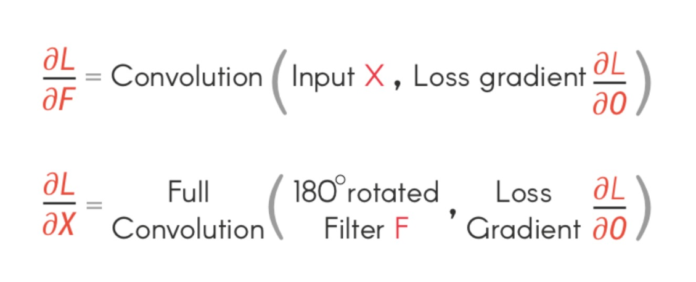
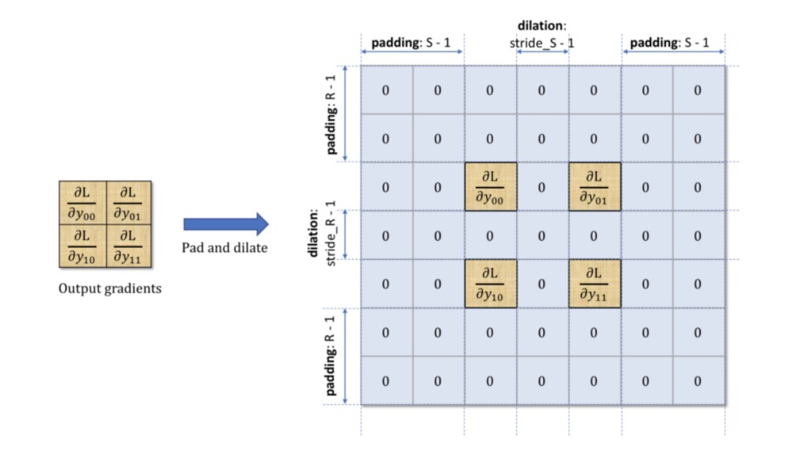
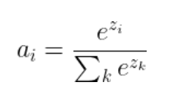
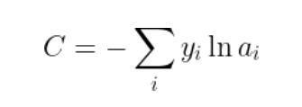
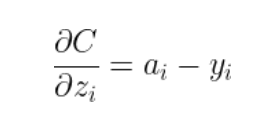

# 人工智能前沿课程报告
# 基于numpy实现卷积神经网络
#### 姓名：胡家欣 学号：3220102880 班级：机械2203 
# 1. 绪论
卷积神经网络（Convolutional Neural Networks，简称CNN）是一种深度学习模型，它在图像和视频识别、分类以及分割等任务中表现出色。CNN的核心思想是通过卷积层来提取输入数据的局部特征，然后通过池化层来降低特征的空间维度，同时增加对图像位移的不变性。
本报告实现了基于numpy的经典卷积神经网络架构(LeNet5)，并实现了向量化运算。在大约20个epoch训练后识别准确度达到90%以上，最高可以达到98%。训练50个epoch大约需要30分钟。
最后推荐一下斯坦福大学的cs231n教程，这个教程帮助了我许多。
## 1.1 运行环境
cupy\==4.1.0
matplotlib\==3.0.0
numpy\==1.15.2
python\==3.5.6
scipy\==1.1.0
tqdm\==4.63.0
## 1.2 数据预处理
利用glob函数读取文件。由于例程给的原代码不能正确读取，所以进行了一些改动，利用glob方法递归搜索整个文件夹。
读取文件后进行归一化处理，并将数据形式转换成(N,C,W,H)的四维数组，其中N表示图片个数，C表示通道数，H,W分别表示高和宽。初始形状为(N,1,28,28)
# 2. 模型设计
## 2.1 向量化实现函数 
笔者一开始使用数组索引的形式计算卷积，但这样做的运算效率很低。于是更换成了向量的形式计算。
函数img2col(x,ksize,stride) 可以将待卷积的向量x中的元素变换排列方式，最终将三通道（C,H,W）（C为通道数，H为图像的高，W为图像的宽）变换成（M,L）的二维数组形式。其中M是卷积滑动的窗口数,L为通道数乘以卷积核大小的平方。
一开始对x的维度进行检查是为了防止索引时造成x只有2维，所以为x补上一个维度。
具体代码如下：
```
def img2col(x,ksize,stride):
    if x.ndim != 3:
        x = x[np.newaxis,:,:]
    C,H,W = x.shape
    # 计算输出的大小  
    H_out = (H - ksize) // stride + 1  
    W_out = (W - ksize) // stride + 1
    image_col = np.zeros((H_out*W_out,ksize*ksize*C))
    num = 0
    for i in range(H_out):
        for j in range(W_out): 
            image_col[num] =  x[:,i*stride:i*stride+ksize, j*stride:j*stride+ksize].reshape(-1)
            num += 1
    return image_col
```
## 2.2 卷积层
卷积层的实现主要参照文献[1][2]，下面将分为前向传播和反向传播叙述，并讨论channel、padding、stride三个因素的影响。输入形状为(N,C,H,W)，卷积核形状为(O,C,WH,WW),输出形状为(N,O,H_OUT,W_out)
1. 前向传播
先计算出输出的图像宽和高并对输入x进行padding的填充
``` 
H_out = (H + 2 * padding - WH) // stride + 1  
W_out = (W + 2 * padding - WW) // stride + 1  
```
```
if self.padding != 0:
    pad_width = ((0, 0), (0, 0), (padding, padding), (padding, padding))  # 在最后两个维度的四周各添加一行  
    # 常数填充  
    self.x = np.pad(x, pad_width, mode='constant', constant_values=0)
```
需要注意的是我们使用四维的卷积核，即对每一个输入通道的x，都有一个卷积核与之对应。详见文献[3]。向量化操作先将输入x利用img2col()函数转换为二维数组，再乘以对应转化的卷积核二维数组即可。大部分实现较为常规。
需要注意的是，上述转换的二维数组相乘后的数组要先进行reshape再进行transpose的操作，具体代码如下，这行代码计算了每个N，对应输出值。读者可以选一个小型数组验证操作上述数组维度变换是否正确。
```
out[i] = (np.dot(image_col,kernel)+self.bias.T).reshape(H_out,W_out,O).transpose(2,0,1)
```
2. 反向传播
反向传播过程较为复杂，大致的结论是：输入x的梯度相当于上游梯度dy对旋转180°后的卷积核F的卷积；卷积核权重的梯度相当于上游梯度dy对输入x的卷积，如下图。具体推导可以参看文献[1][2]

具体实现有如下的细节：
- 计算F与dy的卷积时要先将dy填充padding，padding大小为卷积核大小减1。读者可以自行验证。
```
#填充dy
pad = WH-1
pad_width = ((0, 0), (0, 0), (pad, pad), (pad, pad))  # 在最后两个维度的四周各添加一行  
pad_dy = np.pad(dy, pad_width, mode='constant', constant_values=0)
```
- 考虑padding: 
将输入x添加padding并存入self.x，并在返回dx时截取原来x的形状
- 考虑stride:
计算时需要将dy中间分隔并在四周添加padding

- 考虑多通道:
对于计算dx来说，与前向传播并无本质区别
对于计算w_grad（卷积核梯度）来说，要注意每个输出通道对每个输入x的通道的卷积，对应一个二维卷积核的梯度，而总共有N个样例，所以累加梯度后要除以N，且N并不是与之前一样放在内层循环中。代码如下：笔者之前一直忘记将梯度清零，为此浪费了许多时间。
```
#初始化梯度
self.w_grad = np.zeros(shape=(O, C, WH, WW))
self.b_grad = np.zeros((O, 1))

for j in range(O):

    for i in range(N):

        delta_kernel_0 = dy[i][j].reshape(-1)
        # delta_kernel_1 = np.tile(delta_kernel_0,C)
        # delta_kernel = delta_kernel_1[np.newaxis,:].T
        delta_kernel = delta_kernel_0.T

        for k in range(C):
            image_col = img2col(self.x[i][k],H_out,stride)
            self.w_grad[j][k] += np.dot(image_col, delta_kernel).reshape(WH,WW)

        self.b_grad[j] += np.sum(delta_kernel)

    self.w_grad[j] /= N
    self.b_grad[j] /= N
```
## 2.3 池化层
平均池化层相当于参数均为0.25且无偏置的卷积层，具体实现比卷积层更简单，故不再赘述。
## 2.4 全连接层
输入x形状为(N,C)，输出y形状为(N,O)，权重w形状为(C,O),偏置形状为(1,O)
前向传播为矩阵相乘再加上偏置，唯一需要注意的是加上偏置的操作利用了numpy的broadcasting技巧
反向传播设上游梯度为dy，则dx=dy*(W.T) , dw = (dx.T)*dy

## 2.5 flatten层
flatten层的作用是将特征图“铺平”成二维数组，以便全连接层的实现。
前向传播与反向传播均只涉及形状的变换。
```
class flatten:  
    def forward(self, x):  
        self.shape = x.shape  
        #展平除了第一维的其他三维
        flattened_length = self.shape[1] * self.shape[2] * self.shape[3]  
        flattened_array = x.reshape(self.shape[0], flattened_length)  
        return flattened_array  
      
    def backward(self, dy):  
        dx = dy.reshape(self.shape)  # 重新排列梯度的形状  
        return dx  
```
## 2.6 激活函数
### 2.6.1 sigmiod函数
在深度学习中，由于sigmiod函数单增以及反函数单增等性质，Sigmoid函数常被用作神经网络的激活函数，将变量映射到[0, 1]之间。
前向传播公式为：  $S(x)=\frac {1} {1+e^{-x}}$
反向传播公式为：  $ dx = dy\cdot S(x)\cdot (1-S(x)) $ 
### 2.6.2 relu函数
rulu函数由于其导数为1或0，故可以有效避免梯度消失
前向传播公式为：R(x)=max{0,x}
反向传播公式为：if x>0 return 1 else return 0
## 2.7 损失函数
损失函数采用交叉熵损失函数，具体原理可以参见文献[4],下面
前向传播为先用softmax函数，再用交叉熵损失函数求损失值。
softmax函数：其中$z_i$为全连接层输出，$a_i$为softmax输出

交叉熵函数：其中C表示损失值，$y_i$表示标签值

反向传播结论：

需要注意的是：本报告在代码实现时先对$z_i$减去每一行的最大值再计算softmax，以此避免exp函数的数值溢出错误。

# 3. 训练算法
使用SGD算法进行训练，每个epoch训练以batchsize大小遍历训练集取子集，对每一个子集，只取其中一个样本进行训练。
训练流程为：选择样本、正向传播、计算损失、反向传播（反向传播的同时更新梯度）
验证流程为：在每个epoch训练完成后在验证集以同样batchsize大小进行验证，计算loss值与准确度
# 4. 结果与讨论
## 4.1 模型评估
超参数如下：
```
#define hyperparameters
lr = 0.005
epoch = 50
batch_size = 64
```
下面主要对学习率进行调整改进。
lr=0.01时训练结果如下，可以看到loss值具有较大振荡，于是尝试降低学习率。

lr=0.005时训练结果如下，可以看到loss值小于0.5后仍具有较大振荡，于是尝试分段调整学习率，但效果不太好，可能应该采用Momentum方法。

## 4.2 已知bug
1. sigmiod运算时可能出现数值溢出,$e^{-x}$中x过小可能导致数值过大，但这个bug对sigmiod的计算没有影响，可以忽略
2. 卷积层反向传播中未考虑stride；未考虑padding不为1时dx的计算，但梯度更新是正确的。这个bug对于LeNet5网络并不影响运行。
3. 使用cupy加速训练时遇到了一些问题，暂时未能解决。 "正如 Robert Crovella 在评论中指出的那样，您可能会遇到 TDR 错误，因为更多的迭代可能会延迟 GPU 对查询操作系统的响应时间。"
# 附录
本报告源代码可以在github上下载
https://github.com/xiaoniute/CNN

# 参考文献
[1]https://medium.com/@mayank.utexas/backpropagation-for-convolution-with-strides-8137e4fc2710
[2]https://medium.com/@mayank.utexas/backpropagation-for-convolution-with-stridesfb2f2efc4faa
[3]https://blog.csdn.net/HUST_zxs/article/details/127499955
[4]https://blog.csdn.net/abc13526222160/article/details/84968161